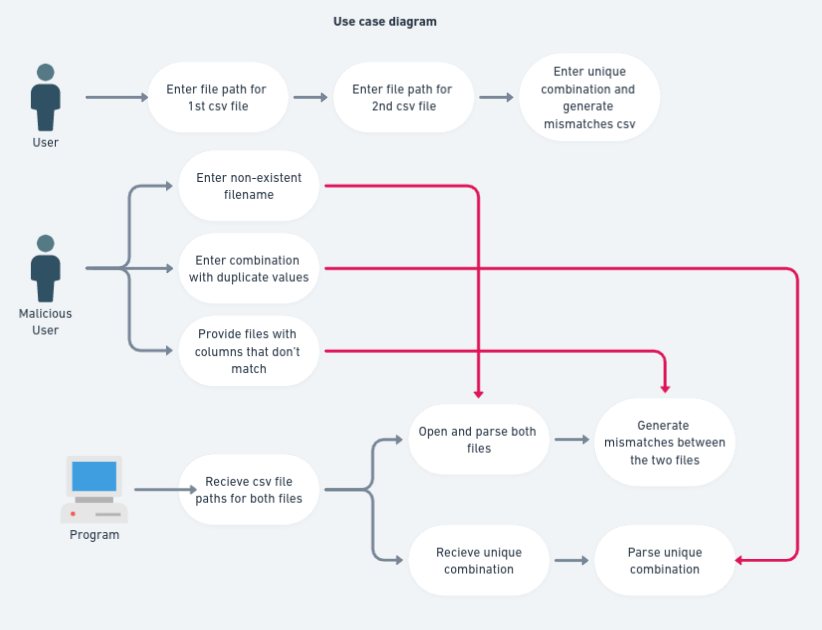

# 50.003-campaign
Software testing campaign repo for Lim Thian Yew (1003158)  
The boundary value + equivilance class stuff is at [boundary value and equivilance class analysis.pdf](boundary%20value%20and%20equivilance%20class%20analysis.pdf)  
Unit tests are in `src/UnitTests.java`, system tests are in `src/SystemTests.java`  

Built and tested on: 
```console
openjdk 16.0.1 2021-04-20  
OpenJDK Runtime Environment (build 16.0.1+9-Ubuntu-120.04)  
OpenJDK 64-Bit Server VM (build 16.0.1+9-Ubuntu-120.04, mixed mode, sharing)  
```
What this project does: given three inputs (two input csv file paths, and a unique combination of columns), generates a new csv file containing the mismatched rows between the two input files.



## Build and test instructions:  
To run the program, run the following in the project root folder. Alternatively, you can build and run the project using IntelliJ IDEA instead (in fact that is the method I using).
```console
javac -cp ./src src/*.java
java src/RecordChecker.java
```

You will be prompted for the filename of the two csv source files, and the unique combination of columns (comma seperated) that you wish to compare them by:  

```console
Hello campaign world
Enter first csv file path: sample_file_1.csv
Enter second csv file path: sample_file_3.csv        
Enter unique combination (comma separated): Customer ID#, Account No., Currency, Type
```

Example shell output (The mismatched rows / exception causing rows will be exported to the mismatches folder by the program):  
```console
COMBINATION [Customer ID#, Account No., Currency, Type]
HEADERS
[Customer ID#, Account No., Currency, Type, Balance]
HEADERS
[Customer ID#, Account No., Currency, Type, Balance]
Successfully wrote mismatches to mismatches/mismatches-220711-214731.csv
```

Example input used to replicate the example output provided in sample_file_output_comparing_1_and_3.csv (typed in user inputs is in green)


## Deployment architecture:
The frontend is deployed as static webpage files using firebase static web hosting, and secured from DDOS attacks using cloudflare, while the backend + MySQL database server is running on a GCP (Google cloud playform) compute instance and secured from DDOS attacks using cloudflare. The advantage of this arrangement is that static frontend files can be served with caching (as they don't change) + CDN optimisation using firebase's own CDN, and also that the frontend deployment can be done independently from the backend and vice versa. The disadvantage is that our system architecure is slightly more complicated than if we deployed everything on just one server, and that we have to protect the frontend and backend from DDOS attacks seperately as well.  


